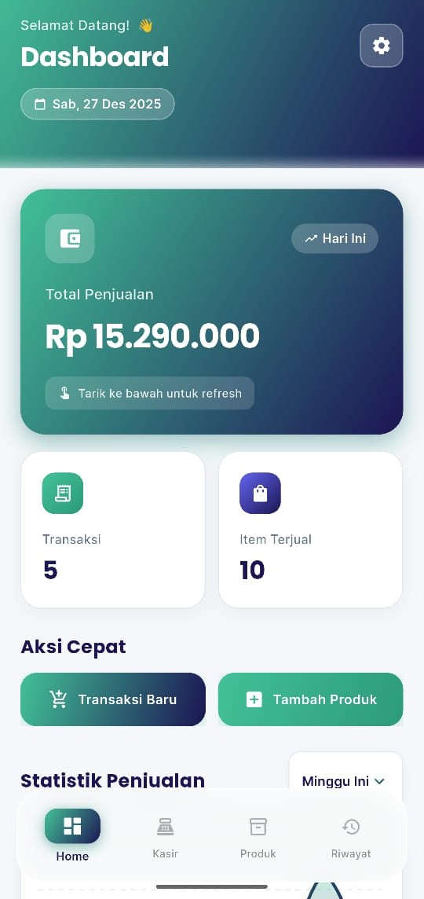
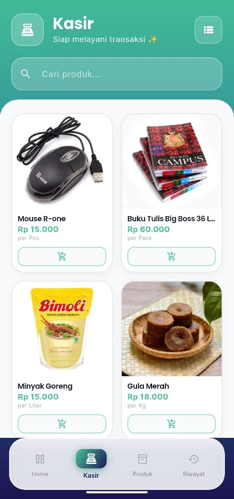
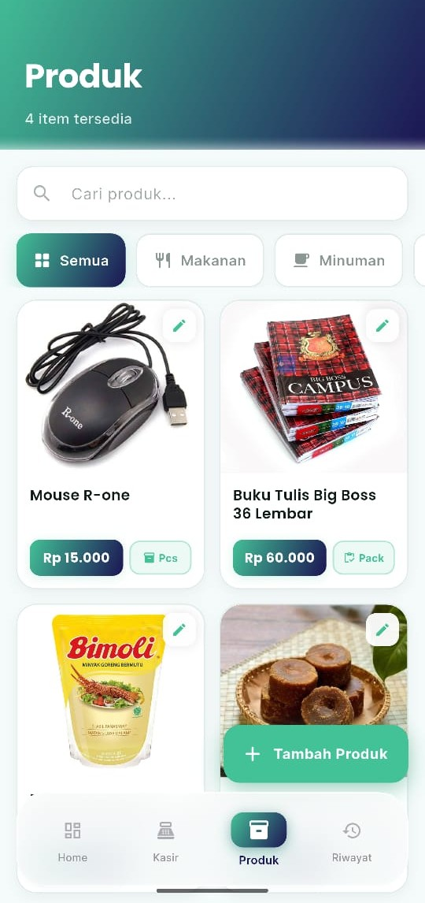
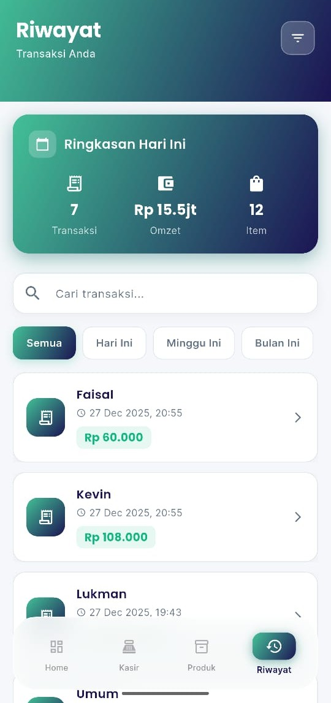
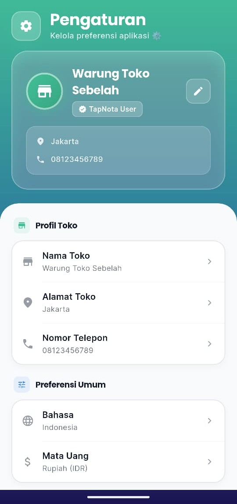

# 🛒 TapNota - Modern POS Application


A beautiful, modern, and **fully offline Point of Sale (POS)** application built with Flutter.  
TapNota is designed specially for **UMKM / Small & Medium Businesses** such as retail shops, cafés, restaurants, barbershops, and service-based businesses.  
Simple, fast, and reliable for daily cashier operations without internet dependency.

---

## 📸 Screenshots

<div align="center">
  
  
  
  
  
  
</div>

---

## ✨ Features

### 🎯 Core Features
- 💰 **Cashier System**
  Fast checkout process with cart system, quantity control, and automatic total calculation.
- 📦 **Product Management**
  CRUD products complete with price, category, and image.
- 📊 **Dashboard Analytics**
  Real-time sales summary based on user transactions.
- 📜 **Transaction History**
  Complete transaction records with details and filters.
- ⚙️ **Settings**
  Basic preferences & store information.

---

## 🎨 UI/UX
- 🌈 Modern teal → indigo gradient theme
- ✨ Premium glassmorphism components
- 🎭 Smooth animations
- 📱 Responsive layout
- 🌙 Dark mode (coming soon)

---

## 🛠️ Technical Details
- 🏗️ Modular & maintainable architecture
- 📦 State Management: **Provider**
- 💾 Local Storage: **SharedPreferences**
- 💱 IDR Currency formatting
- 🧪 Built with Flutter 3+

---

## 🚀 Getting Started

### Prerequisites
- Flutter `>= 3.0.0`
- Dart `>= 3.0.0`
- Android Studio / VS Code
- Git

### Installation
```bash
git clone https://github.com/GigaFdlh/TapNota-app.git
cd tapnota
flutter pub get
flutter run
````

---

## 📁 Project Structure

```
lib/
├── models/              # Data models
│   └── models.dart
├── providers/           # State management
│   ├── cart_provider.dart
│   ├── product_provider.dart
│   ├── settings_provider.dart
│   └── transaction_provider. dart
├── screens/             # UI screens
│   ├── cashier/         # Cashier module
│   │   ├── utils/
│   │   ├── widgets/
│   │   └── cashier_screen.dart
│   ├── dashboard/       # Dashboard module
│   ├── history/         # Transaction history
│   ├── product/         # Product management
│   ├── settings/        # App settings
│   ├── splash/          # Splash screen
│   └── main_screen.dart
├── services/            # Business logic
│   └── storage_service.dart
├── widgets/             # Shared widgets
│   └── navbar.dart
├── main.dart            # App entry point
└── utils.dart           # Utility functions
```

---

## 🎯 Current Scope

✔ Offline & Local
✔ Real transaction analytics
✔ Focus Android first
✔ Simple & practical for UMKM

---

## 🛣️ Roadmap

* [x] Core POS Features
* [x] Dashboard & Analytics
* [x] Product Management
* [x] Transaction History
* [ ] Dark Mode
* [ ] Export PDF / Excel
* [ ] Receipt Printer Integration
* [ ] Cloud Sync (Future)
* [ ] Multi Store Support
* [ ] Offline + Online Hybrid Mode

---

## 📄 License

MIT License — see `LICENSE`

---

## 👨‍💻 Author

**Your Name**
GitHub: [https://github.com/GigaFdlh](https://github.com/GigaFdlh)
LinkedIn: [https://linkedin.com/in/gigafadhillah](https://linkedin.com/in/gigafadhillah)
Email: [gigakurnia81@email.com](mailto:gigakurnia81@email.com)

```